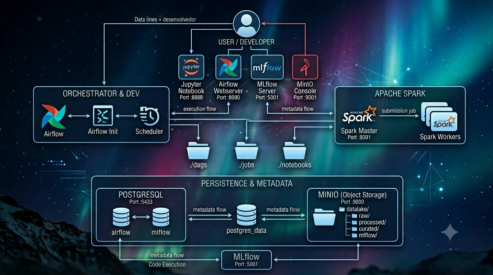
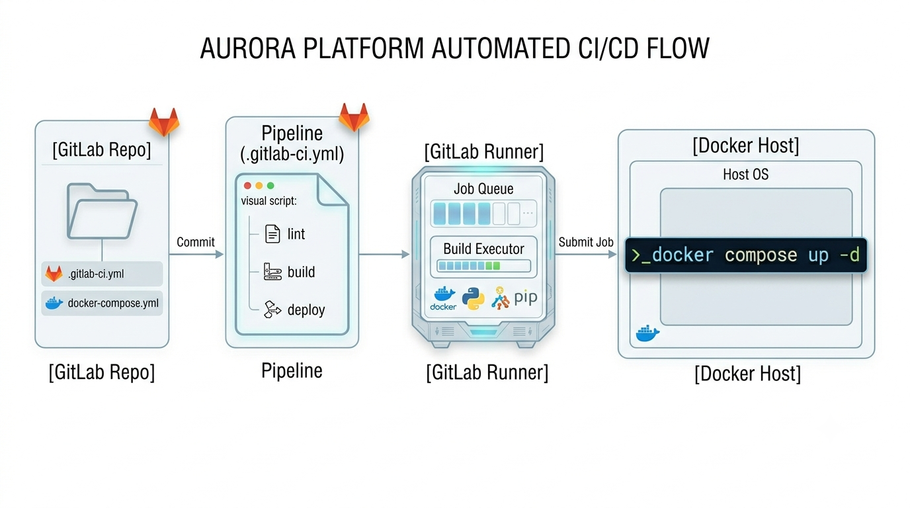

# 🌌 Aurora - Generic Data & Machine Learning Platform

This repository contains the completely generic, decoupled infrastructure blueprints for the **Aurora** platform—an enterprise data engineering and Machine Learning lifecycle ecosystem deployed via Docker Compose on our server network. Deployment, continuous structural linting, and background infrastructure synchronization are 100% automated via **GitLab CI/CD GitOps pipelines**.

---

## 🏗️ Platform Architecture

The platform architecture isolates every service within a dedicated runtime network layer to ensure zero configuration collisions and secure, portable deployment bounds across Development, Staging, and Production environments.



### 🧩 Core Components

* **Orchestration Engine:** Apache Airflow 2.8.1 configured via `LocalExecutor` for concurrent local tasks.
* **Distributed Computing:** Apache Spark (Master/Worker) cluster architecture tuned for large-scale data transformation jobs.
* **Object Storage Layer (S3 API):** MinIO featuring automated, reactive provisioning of a complete Medallion Architecture (`raw`, `processed`, `curated`).
* **ML Experiment Lifecycle:** MLflow Server capturing processing metrics in PostgreSQL and tracking model artifacts securely in MinIO.
* **Interactive Workspace:** Jupyter Notebook bundled with Hadoop AWS libraries and native PySpark session execution hooks.
* **Relational Metastore:** PostgreSQL 13 serving as the unified transactional backend layer.

---


## 🗺️ Ports and Infrastructure Map

All services expose configurable boundary host ports mapped out inside your environmental runtime profile[cite: 1, 5].

| Service | Container Internal Port | Default Host Mapping | Web / API Access Endpoint |
| :--- | :---: | :---: | :--- |
| **Apache Airflow Web** | `:8080` | `${AIRFLOW_WEB_PORT}` (`:8090`) | `http://<HOST_URL>:8090` |
| **MLflow Server** | `:5000` | `${MLFLOW_PORT}` (`:5001`) | `http://<HOST_URL>:5001` |
| **MinIO Console** | `:9001` | `${MINIO_CONSOLE_PORT}` (`:9001`) | `http://<HOST_URL>:9001` |
| **MinIO API (S3)** | `:9000` | `${MINIO_API_PORT}` (`:9000`) | `http://<HOST_URL>:9000` |
| **Spark Master UI** | `:8080` | `${SPARK_MASTER_PORT}` (`:8091`) | `http://<HOST_URL>:8091` |
| **Jupyter Notebook** | `:8888` | `${JUPYTER_PORT}` (`:8888`) | `http://<HOST_URL>:8888` (Token: admin) |
| **PostgreSQL Backend** | `:5432` | `${POSTGRES_PORT}` (`:5433`) | Relational Metastore |

---

## ⚙️ Environment Provisioning & Quick-Start

To maintain production security standards, runtime credentials are strictly ignored by source control[cite: 2]. Follow this protocol to deploy the stack:

1. **Clone the repository** into your local workspace or target deployment boundary runner.
2. **Instantiate your environment file** from the generic tracking blueprint template:
   ```bash
   cp .env.example .env

   ```


   Configure parameters inside .env (such as custom database passwords, distinct host ports, or specific environment profile labels).
---

## 📂 Project Structure and Directories

Below is the layout of files in the repository. Development and data volumes are mapped directly on the host server to ensure proper persistence:

```text
aurora/
│
├── docker-compose.yml     # Definition and orchestration of all platform containers
├── .gitlab-ci.yml         # Configuration of automated pipelines and continuous deployment
├── .env.example           # Tracked configuration blueprint mapping credentials and port entries
│
├── docker/                # Customized Dockerfiles for the Aurora platform
│   ├── spark/
│   │   └── Dockerfile     # Customized Spark image with Hadoop/S3 connectors
│   └── mlflow/
│       └── Dockerfile     # Customized MLflow Server image with Postgres/Boto3 dependencies
│
├── dags/                  # Local Volume: Apache Airflow DAG declaration scripts
├── jobs/                  # Local Volume: Executable scripts (.py) and packages (.jar) for Spark
└── notebooks/             # Local Volume: Persistence of Jupyter notebooks and work data

```


## 🚀 Continuous Integration and Deployment Flow (CI/CD)

The GitLab pipeline (.gitlab-ci.yml) is configured to perform continuous automation and deployment directly on the host infrastructure via the following macro flow:



### ⚙️ What the Pipeline Does Automatically

1. **Syntactic Validation Linter:** Mandatory execution of `docker compose config -q` to ensure that no invalid YAML indentation or property breaks the server before deployment.
2. **Intelligent Image Pull:** Updates upstream base images (`postgres`, `minio`, `airflow`). Failures in locally created images (`spark-custom`, `mlflow-custom`) are resiliently ignored to preserve the server's internal cache.
3. **Dynamic Hard Cleaning:** Algorithmic engine scan programmatically tracking active environment targets (`docker compose ps -a -q`) to isolate and force immediate removal of zombie processes or instances stuck in memory.
4. **Network and Orphan State Purge:** Execution of the `docker compose down --volumes --remove-orphans` command, mitigating Docker network virtual interface conflicts or invalid states.
5. **Orchestration and Healthcheck:** Clean initialization of the stack in the background (`docker compose up -d`), strictly respecting the initialization order and integrity dependencies (`healthcheck`).

---


## 🛠️ Useful Maintenance Commands (SSH Access on the Server)

In case you need to interact manually with the infrastructure directly via the `<HOST_URL>` terminal:

### Verify if all containers are healthy

> [!TIP]
> Check the `STATUS` column to ensure that services are showing (`healthy`) before submitting heavy jobs.

```bash
docker compose ps

```

### View logs in real time

```bash
# Logs from the MLflow server
docker compose logs -f mlflow

# Logs from the Spark processing stack
docker compose logs -f spark-master spark-worker

```

### Bring down the infrastructure keeping the saved data

```bash
docker compose down

```

### Force a safe restart of services

```bash
docker compose restart

```

### Complete environment reset

> [!WARNING]
> The command below permanently erases all databases and files stored in the Data Lake (MinIO) to restart the stack from scratch.

```bash
docker compose down --volumes --remove-orphans

```


## 💻 Integration Specifications

### Connecting Spark to MinIO (Object Storage Target)

To execute distributed pipelines directly into the object storage framework, use this standard session template setup:


```python

from pyspark.sql import SparkSession

spark = SparkSession.builder \
    .appName("Aurora-Data-Ingestion") \
    .config("spark.hadoop.fs.s3a.endpoint", "http://minio:9000") \
    .config("spark.hadoop.fs.s3a.access.key", "admin") \
    .config("spark.hadoop.fs.s3a.secret.key", "admin123") \
    .config("spark.hadoop.fs.s3a.path.style.access", "true") \
    .config("spark.hadoop.fs.s3a.impl", "org.apache.hadoop.fs.s3a.S3AFileSystem") \
    .getOrCreate()

# Reading data from the raw bucket zone
df = spark.read.json("s3a://datalake/raw/transactions/")

```

### 2. Experiment Tracking via MLflow

Direct metrics tracking workflows and output model configurations directly to the isolated infrastructure cluster layout by configuring target tracking parameters:

```python

import mlflow

# Points to your isolated Aurora MLflow service port configuration boundary
mlflow.set_tracking_uri("http://<HOST_URL>:5001")
mlflow.set_experiment("Aurora_Production_Modeling")

with mlflow.start_run():
    mlflow.log_param("learning_rate", 0.01)
    mlflow.log_metric("accuracy", 0.96)

```


